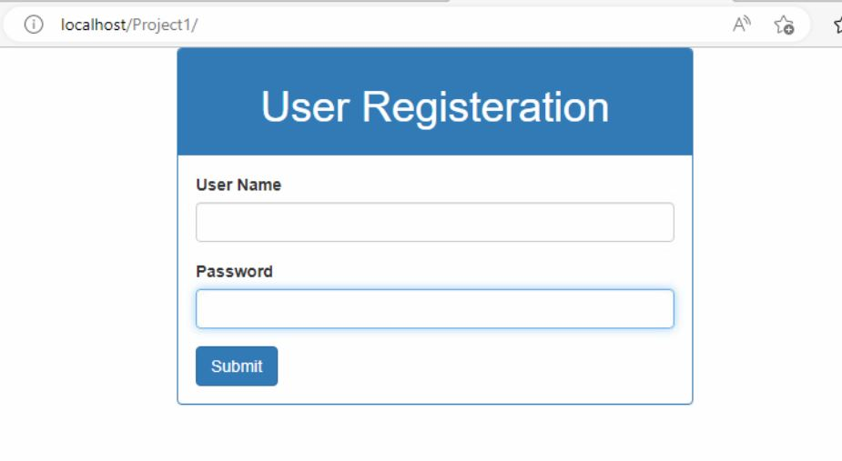
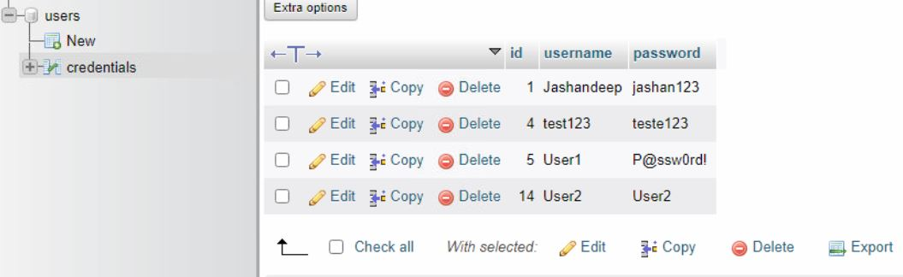
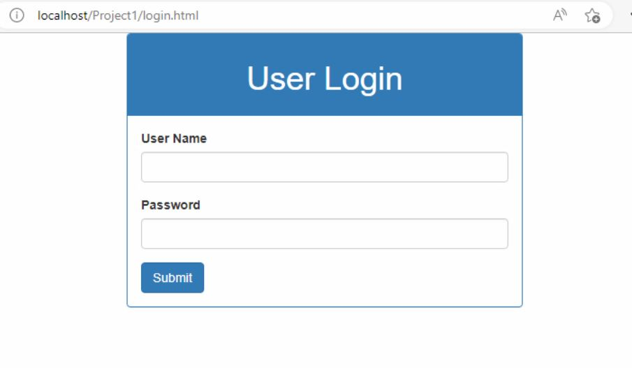

# Connecting MySQL with website using PHP

**Front end**
-----------------------------------------------------------------------------

- Website with a form to enter data.
- A submit button to send this data to the web server for further processing.

**Back end**
-----------------------------------------------------------------------------

- MySQL server up and running.
- A new database with a table in it.
- Table with proper number of columns.

**Getting started**
==============================================================================

## Installing XAMPP to host website and MySQL ##

1. Go to the browser and download the latest version of XAMPP.

2. Install it on your PC. Start Apache and MySQL.

3. Go to the browser and type `http://localhost`. It should bring you to the startup page of Apache server. You should be able to see the phpMyadmin portal now.

4. Click on *phpMyadmin* and you'll see the database portal.

5. Now create a *New Database* with a suitable name and a *table* with any number of columns.

6. We'll be inserting the data into these columns. So name those columns accordingly. For instance, `column1` - *username*  and `column2` - *password*.

7. Now, it's time to create a relatively simple webpage to receive data.

8. You can use the following code -

```html
<!DOCTYPE html>
<html>
    <head>
        <title>User Registeration</title>
        <link rel="stylesheet" href="bootstrap.css">
    </head>
    <body>
        <div class="container">
            <div class="row col-md-6 col-md-offset-3">
                <div class="panel panel-primary">
                    <div class="panel-heading text-center">
                        <h1>User Registeration</h1>
                    </div>
                    <div class="panel-body">
                        <form action="connect.php" method="post">
                            <div class="form-group">
                                <label for="username">User Name</label>
                                <input type="text" class="form-control" id="username" name="username" required>
                            </div>
                            <div class="form-group">
                                <label for="password">Password</label>
                                <input type="text" class="form-control" id="password" name="password" required>
                            </div>
                            <input type="submit" class="btn btn-primary">
                        </form>
                    </div>
                </div>
            </div>
        </div>

    </body>
</html>
```

Php code to connect to database and INSERT data in table -

```php
<?php
// Creating variables to receive data from index.html via POST method.
$username = $_POST['username'];
$password = $_POST['password'];

// Attempting to  connect to database.

$server_name='localhost';
$data_user='root';
$data_password='';
$data_name='users';

$conn=mysqli_connect($server_name, $data_user, $data_password,$data_name);

// Warns if conenction failed.
if(!$conn){
    die('Connection Failed: ' .mysqli_connect_error());
}

// If conenction is successful
else{

    // Inserting data.
    $sql_query = "INSERT INTO credentials (username, password) VALUES ('$username','$password')";
    if (mysqli_query($conn, $sql_query)){
        echo "Regitered Successfully..!";
    }
    // If error occurs while inserting data.
    else{
        echo "Error occured: " . $sql . "" . mysqli_error($conn); 
    }
    // Connection closed.
    mysqli_close($conn);
}
?>
```

```You'll find bootstarp.css & connect.php in this repository.```

*Up untill this point, we have a web interface where users input data i.e. Username and Password and we are storing this data into our MySQL database running on localhost using XAMPP control. Php acts as a connector between webpage and the database.*

*Moving forward*
===================================================================================

*Creating a login page*

------------------------------------------------------------------------------------

**Now let's expand this project a little bit. We're going to create another webpage where users can query our database. First, they'll have to login; if valid, they will be redirected to a page where they can query the database.**

1. Copy `index.html` and rename it as `login.html`.
2. We're going make to use this page for receiving data from the user and then hand it over to `login.php` for comparing it with database.
3. You can use the following code for `login.html` -

```html
<!DOCTYPE html>
<html>
    <head>
        <title>User Login</title>
        <link rel="stylesheet" href="bootstrap.css">
    </head>
    <body>
        <div class="container">
            <div class="row col-md-6 col-md-offset-3">
                <div class="panel panel-primary">
                    <div class="panel-heading text-center">
                        <h1>User Login</h1>
                    </div>
                    <div class="panel-body">
                        <form action="login.php" method="post">
                            <div class="form-group">
                                <label for="username">User Name</label>
                                <input type="text" class="form-control" id="username" name="username" required>
                            </div>
                            <div class="form-group">
                                <label for="password">Password</label>
                                <input type="password" class="form-control" id="password" name="password" required>
                            </div>
                            <input type="submit" class="btn btn-primary">
                        </form>
                    </div>
                </div>
            </div>
        </div>
    </body>
</html>
```

4. Create a new `.php` file for handling login requests.

5. We're going to use `SELECT` statement to verify the user credentials. You can use the following code -

```php
<?php
// Creating variables to receive data from login.html via POST method.
$username = $_POST['username'];
$password = $_POST['password'];

// Attempting to  connect to database.

$server_name='localhost';
$data_user='root';
$data_password='';
$data_name='users';

$conn=mysqli_connect($server_name, $data_user, $data_password,$data_name);

// Warns if conenction failed.
if(!$conn){
    die('Connection Failed: ' .mysqli_connect_error());
}

// If conenction is successful
else{

    // Comparing credentials.
    if ($result = $conn -> query("SELECT * FROM credentials WHERE username='$username' AND password='$password'")) {
        // If the username and password exists/matches with what user provided us, then let them in.
        if($result -> num_rows == 1){
            echo "Welcome ". $username . ", you have successfully logged in.";
        }
        else{
            // If credentials are incorrect.
            echo "<script>alert('Invalid credentials!')</script>";
            echo "<script>location.replace('login.html')</script>";  
        }
       // Free result set.
        $result -> free_result();
    }
    // Connection closed.
    mysqli_close($conn);
}
?>
```

*login.php & login.html are in this repository.*

**Note: Please keep all these files, including `bootstrap.css` in the same folder if you're using attached files.**

*By this point, we have created a very simple login system to demonstrate html, php & MySQL. Although, this is not an effective way of handling login data because of security concerns, we'll create an advanced version of this project with some basic security postures in place.*

*Here are some sample output pictures for reference:*

**User Registeration page**



**Database entries**



**User Login**



***Feel free to reach out at jsdeep467@gmail.com or [website]***

[website]: https://jashansandhu.online
